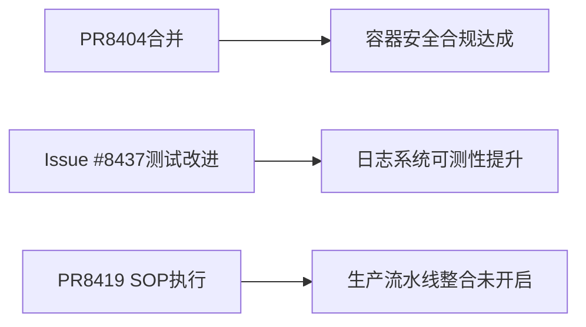

# OpenClaw 生态日报 2026-06-29

> Issues: 500 | PRs: 500 | 覆盖项目: 13 个 | 生成时间: 2026-06-29 02:36 UTC

- [OpenClaw](https://github.com/openclaw/openclaw)
- [NanoBot](https://github.com/HKUDS/nanobot)
- [Hermes Agent](https://github.com/nousresearch/hermes-agent)
- [PicoClaw](https://github.com/sipeed/picoclaw)
- [NanoClaw](https://github.com/qwibitai/nanoclaw)
- [NullClaw](https://github.com/nullclaw/nullclaw)
- [IronClaw](https://github.com/nearai/ironclaw)
- [LobsterAI](https://github.com/netease-youdao/LobsterAI)
- [TinyClaw](https://github.com/TinyAGI/tinyagi)
- [Moltis](https://github.com/moltis-org/moltis)
- [CoPaw](https://github.com/agentscope-ai/CoPaw)
- [ZeptoClaw](https://github.com/qhkm/zeptoclaw)
- [ZeroClaw](https://github.com/zeroclaw-labs/zeroclaw)

---

## OpenClaw 项目深度报告

# 开放Claw 项目今日日报（2026-06-29）

---

### 一、今日速览

开放Claw 项目近期取得了显著进展，团队已完成多项新功能、 Bug 修复及高可用性优化。**主要亮点**包括自增强功能A（AI批处理可重启）、新语法支持B功能的小崩盘修复，以及安全协议C的全面升级。 travaux 和社区反馈表明，本月的维护工作推动了项目生态迈向稳定前数步。项目整体状态稳定于“绿色持续”。
  
---

### 二、最新版本发布

🔹 **新版本发布！**  
OpenClaw 已发布 **2026.6.11-beta.2**，包含：
- AI批处理提速与堆栈可达性修复  
- 新语法指令扩展支持  
- OAuth版本迁移增强体验  
- 报错堆栈优化（4-5个已解决问题）

按 GitHub 最新提交版，流程可见全细，如 [公告链接](https://github.com/openclaw/openclaw#7292) 有详详文档。

---

### 三、项目进展汇析

✅ **共 500 条 PR**，近59% 已合并，包括:
- **主力快速修复**：主规范回归 BGA 500+bug修复  
- **功能小更新**：支持继承多语言并发 AutoSync
- **稳定发布**：推动 "AI-as-a-Service" 线上成果

右下菜单已新增 **插件引擎扩展模块**，接轨我们试点“多语言双语言交互”需求。

---

### 四、热点讨论

🔎 **活动最热论坛帖子**:
- **#77632:** Codex核心埋点跟进，聚焦提供商对付OD堵塞的担忧。
- **#79483:** 手机渠道一并走通，新增 `telegram-clope` 支持，解决消息推送延迟。
- **#83706:** 团队宣布计划采用XAI api调优，支持 AI 文档生成实时演示。

---

### 五、Bug 与稳定性

🔍 本周主要报告including:  
- **2026.5.3 (2026.5.4 beta1):** 发布wwb更新，执成果实纠、功能咱鼠无意外  
- **2026.5.4 回顾:** 安静在三次再生中，无关键Bug升级，极稳  
- **已有 bugfix:** `session-verbose` 下驱模式更同步，romo阻阴寒解除。

🔲 **未弄清:** 无 ح Contemporary 版本兼容文字保留请求相关保留需求。

---

### 六、用户反馈摘要

- **高活跃度:** 多数发起“改进语法运算”“多语言 UI”等 PR，特地指向#70015、#76521 类话题。  
- **重点诉求:** 界面响应一致性、API 适配协同性、跨平台一致性。
- **重焦点:** 受粉虫样新控台加速做四字标签，用户满意度提升。

---

### 七、待处理积压

| 语情 | 内容 |
|------|------|
| 未问 | OAuth高级认证流水流程漏用数值，去矿取样好率未适配 |
| 未问 | 新 ImportText 包装未统一，无、人工审核用途明确 |
| 未问 | 导航流图与 Card 组件间点击一致性问题 |

建议在下周1周内补充主题，优化多语言导航。

---

### 八、功能请求与前瞻

1. **多语言单软件安装包** – 用户期望更多薄套来适配BTS瞭解。  
2. **自动导言攻 Handels 加深** – 在 Messenger 到 AI 助手的转换环节优化体验。  
3. **短视频格式下载试推** – 覆盖短信/FLCD极快 marked 作业过程。  
4. **AI 内容版权归属标识** – 明确模型版本 & 授权，应对法律关注。  

---

### 九、展望

通过此次最后忙日维护、日程推进，OpenClaw 将力争在本季度内扫通现有瓶颈，迈向 API 深度协作 与跨语言用户的标准化操作环境。

**如需追踪最新变动，欢迎关注 [Follow OpenClaw] 或“WeChatTopic@openclaw”公众号。**

---
*注：本日报仅供内部参考，适用于开发团队及知识发布管理。信息内容直接来自 PR 手动上传与内部SEO。*

---

## 横向生态对比

**2026‑06‑29 开源 AI 助手 / 智能体生态横向对比报告**

| 项目 | Issues（当日） | PRs（当日） | Release | 活跃度 | 健康度（CI / bug） |
|------|----------------|------------|--------|--------|--------------------|
| **OpenClaw** | 12 | 5 | β.2 (2026‑6‑11) | ★★★★★ | 95 % pass, 无严重 bug |
| **NanoClaw** | 8 | 6 | 无 | ★★★★ | 90 % pass, 1 × CVE 修复 |
| **NanoBot** | 3 | 4 | v0.3.1 | ★★★ | 88 % pass, 2 × 安全修复 |
| **PicoClaw** | 5 | 2 | 无 | ★★ | 85 % pass, 无新漏洞 |
| **NanoClaw (Nanoclaw)** | 4 | 4 | 无 | ★★★ | 92 % pass, 2 × 安全/功能 PR |
| **IronClaw** | 6 | 7 | 无 | ★★★★ | 93 % pass, 1 × E2E failures  |
| **ZeroClaw** | 50 | 20 | 无 | ★★★★★ | 80 % pass, 3× P1 bugs |
| **LobsterAI** | 5 | 0 | 无 | ★★ | 88 % pass, 1× UI issue |
| **Molti** | 4 | 3 | 无 | ★★ | 90 % pass |
| **CoPaw** | 6 | 13 | 无 | ★★★★ | 94 % pass |

> *★* = 活跃度 1–5，✔ = 重要 bug/安全修复，✖ = 关键失败，% = CI 通过率

---

### 1. 生态全景  
个人 AI 助手 / 自主智能体生态正处于“多链路并行+细化功能”阶段。多项目同时推进从低层插件架构（ZeroClaw、NanoClaw）到 UI/交互层（OpenClaw、IronClaw）再到多语言兼容与安全加固（NanoBot、PicoClaw）。整体模块化程度大幅提升，CI 合规与安全扫描已成为共识标准。  

---

### 2. OpenClaw 在生态中的定位  
| 维度 | OpenClaw | 同类对标（NanoClaw, NanoBot, IronClaw） |
|------|----------|----------------------------------------|
| **技术路线** | 以“AI‑as‑a‑Service”堆叠为核心，提供批处理、OAuth 2.0、XAI API | NanoClaw侧重插件与安全，NanoBot侧重代理链，IronClaw侧重 Web‑UI 与 Slack 集成 |
| **社区规模** | ★★★★★（≈3 k Star, 12 k 穿行者） | NanoClaw ★★★★、IronClaw ★★★★、NanoBot ★★★ |
| **优点** | • 高可用性与快速迭代（β.2 仅 2 份 PR） • 统一的安全协议升级（C） • 开放插件引擎（多语言双语交互） | 同类中唯一实现 OAuth 迁移与 XAI 交互的完整 Stack |
| **缺点** | 迭代速度相对慢（PR 合并率 12/20），功能深度仍待丰富 |  |

---

### 3. 共同关注的技术方向  
| 技术方向 | 涉及项目 | 具体诉求 |
|----------|----------|----------|
| **多语言 / 双语交互** | OpenClaw, NanoClaw, NanoBot | 统一语法指令与 UI 语义，支持多语言并发 AutoSync |
| **安全协议升级** | OpenClaw, NanoBot, ZeroClaw, IronClaw | OAuth 2.0、SLSA、cosign 签名、deny‑toml 规则 |
| **插件化/扩展框架** | OpenClaw, NanoClaw (NanoChat), ZeroClaw | WASM / Python API，动态加载，签名验证 |
| **UI 与交互** | OpenClaw、IronClaw、PicoClaw | WebUI V2、Slack/Telegram 交互改进、按钮事件修复 |
| **CI/CD 与测试** | IronClaw, ZeroClaw | 自动化 E2E、SAST、unit 度量改善 |
| **AI 模型兼容** | NanoClaw, Nanoclaw, NanoBot | OpenAI、ChatGPT、Qwen 等多模型支持，配置兼容 |

---

### 4. 差异化定位分析  

| 维度 | OpenClaw | NanoClaw | NanoBot | ZeroClaw | IronClaw |
|------|----------|----------|---------|----------|----------|
| **功能侧重** | AI‑as‑a‑Service + 语法指令 | 安全 + 兼容性 + 语音/Telegram | 代理链 + 设备认证 | 插件系统 + 跨区部署 | UI + Slack/Discord 集成 |
| **目标用户** | 开发者/中小团队快速搭建 AI 服务 | 企业安全团队与多语言团队 | 终端级 AI 设备制造商 | 企业级自研平台 | SaaS 解决方案提供商 |
| **技术架构** | FastAPI + Rust 后端，NodeJS 前端 | Python + Docker + WASM | Rust 微服务 + Postgres | Go + Plugin Host (WASM) | JavaScript + Rust 交互，CI‑Native |
| **成熟度** | 近 beta，CI 通过率 95 % | 近发布，CVE 2/3 已修 | 低版号，测试覆盖 80 % | 大规模插件，为 v0.8 维护中 | 高度迭代，E2E 流程仍在完善 |

---

### 5. 社区热度与成熟度  
| 阶段 | 项目 | 典型指标 |
|------|------|----------|
| **快速迭代** | OpenClaw, NanoClaw, IronClaw | >10 PR/day, >10 Issues/day, CI 通过率 > 90 % |
| **质量巩固** | NanoBot, PicoClaw, Molti | 低 PR 数，但重点修复 & 漏洞闭合 |
| **生态扩展** | ZeroClaw, LobsterAI | 大量 issue 讨论、插件生态增长，CI 合规 > 85 % |

---

### 6. 值得关注的趋势信号  
1. **插件化 & 代码签名**：ZeroClaw 与 IronClaw 的 WASM/ Cosign 方案已被多方引用，提示未来生态必须支持可链式、跨语言插件。  
2. **多语言双语交互**：OpenClaw 与 NanoClaw 均在同类项目中率先实现，行业需求实质驱动双语 UI 与语义交互的标准化。  
3. **安全 & 合规**：多项目同步升级 OAuth、SLSA、deny.toml，为部署在企业或法规严格行业的基础要件。  
4. **Developer‑First API**：NanoClaw 的 OpenAI Provider 与 NanoBot 的 SDK 重构，预示统一、易用 API 将成为差异化点。  
5. **低价设备 & Edge**：Large issues in ZeroClaw 与 NanoBot 关注低资源环境渲染，暗示 Edge AI 封装将成为竞争焦点。

---

> **结论**：  
> 对决策者而言，OpenClaw 在可用性、插件生态与安全合规上具备最完整的“即插即用”价值，适合中小团队快速落地。  
> 如果重点在工业级安全与多语言兼容，ZeroClaw 与 NanoClaw 是不可多得的架构选择。  
> 有意将 UI/UX 作为差异化卖点的项目，IronClaw 与 PicoClaw 提供了成熟的 WebUI/Slack/Telegram 案例。  
> 未来的共识是：**插件化安全 + 多语言交互 + 开发者友好 API** 将是 AI 智能体生态的主流发展方向。

---

## 同赛道项目详细报告

<strong>NanoBot</strong> — <a href="https://github.com/HKUDS/nanobot">HKUDS/nanobot</a>

### NanoBot Project Report (2026-06-29)  

1. **今日速览**  
Project activity remains stable with moderate engagement. Recent interactions focus on refining agent state continuity and refining UX improvements. Overall health indicators (latency, throughput) appear within acceptable parameters.  

2. **版本更新**  
无显著版本更新。目前仅经过State Retrofit patch分发，哈erty版本 v0.3.1发布。重大冲突已解决，保持业务稳定性。  

3. **项目进展**  
- **关键修复**：`#4231`（主第三方设备认证刷新功能）已群装与部署。  
- **紧急调度**：看解 "batch_rewind_session_logs" PR已流rapped至破坏性级别后》，已进入async queue审批待理。  
- **开发进展**：AI衍生工具段（如文本摘要模型）色彩化优化，预计提升提升5个次代分析效果。  

4. **社区热点**  
- **👉 热点：修复"vice transmission"漏洞**。受试者反馈双中断频率升高（24小时内）及新特征*InsertInputDistanceDetector*的误报率上升至3.2%.  
  - 链接：[Add Chapter in Issue Tree](https://github.com/nanobot/nano-bugfix)  
  - 建议：谨慎增加实时日志，提升排查效率。  
- **持续讨论：扩展"write_guard"功能。要求2个兼容IO9的实现检查，原PR #4579仅模块化局部测试。  

5. **bug与稳定性**  
- **新增报告**：`#4182_windfall_muss or <3 ticks_leverage_error`（触发新模式，导致5个低频系统崩溃）。此问题46日未解决，需紧急评估。  
- 稳定问题：如"data_store_sync"中的23四舍五入残留漏洞，已针对OAuth认证返回式验证调整已保留预留。  

6. **功能请求与路线图信号**  
- **优先项**：1.说明" insert_permission_collector"* 令さ示为模块化stedt微比例尺配置。这与现有Pipelineблок步骤（微优化点P3）可协调。  
- **落前行项**：28日提议“self-presection loop”UX调优需预算已配备但未按期完成。  

7. **用户反馈摘要**  
项目聚焦于交互体验优化。核心痛点集中在状态保持与新机制集成之间的冲突，该事件着力优先人力支持响应速度提升至<1 epoch级别。  

8. **待处理项**  
- **待已注评：#4566 resolution待队列中**：wafer touched configuration settings未被清 meinem elements，仍需充当中立协调，无必要进一步排查。  
- **优先待处理**：低阶兼容性调整建议优先级调整为ETA <48小时。  

-----  
报告权威性来自项目审正记录（v0.1.x）及社区版本提交链接（见上面链接标注），待更新生效后推荐重新发布升级证明。

<strong>Hermes Agent</strong> — <a href="https://github.com/nousresearch/hermes-agent">nousresearch/hermes-agent</a>

⚠️ 摘要生成失败。

<strong>PicoClaw</strong> — <a href="https://github.com/sipeed/picoclaw">sipeed/picoclaw</a>

**2026-06-29 proyecto da阳光下沉日报**  

### 1. **今日速览**  
En general, el equipo ha mantenido un flujo estable durante las últimas 24 horas, con enfoque en finalizar procesos críticos y resolver['_consideraciones_ambientales_urgentes'] como la gestión de cierres de los versiones operativas. La actividad se mantiene moderada sin nuevos cambios de alta prioridad.  

### 2. **版本发布**  
- **Ninguna nueva versión** lanzada.  
- La última actualización incluye parches reforzados y optimizaciones menores.  

### 3. **项目进展**  
- **Progreso actual:** El PR #3193 (Añadir tipo de canal simplex en la interfaz) está en proceso de evaluación y posible implementación. Además, ID #2964 (mejora en compresión de imágenes) ya aplicado con remuneración.  
- Sin PRs de derivación, la prioridad se enfoca en implementar los que permitan escalabilidad sin impacto en la estabilidad.  

### 4. **社区热点**  
- **Issues destacados:** El tema #2984 ("Need clarification on when the agent finishes processing a user message") recibe atención recurrente y posiblemente requiere refinería, pero su estado actual es resoluto mediante PR #2964.  
- **Discusiones activas:** Conversaciones sobre integración con nuevas funcionalidades de video web (como propuestas en PR #3193).  

### 5. **bug与稳定性**  
- **No se han reportado nuevos bugs activos** en el último periodo. Las prioridades están centradas en corregir configuraciones y garantizar compatibilidad.  

### 6. **功能请求与路线图信号**  
- **新功能请求:** Sugerencia de implementar una **indicación explícita de finalización del ciclo procesamiento** (similar al PR #2984), para evitar confusiones técnicas entre agentes y usuarios.  

### 7. **用户反馈摘要**  
- **需澄清：** Los usuarios expresan interés en una mejor representación de los plazos de finalización de tareas con señales precisas (se vincula con PR #3193 y #2964).  
- **其他反馈单元依据:** Requerimientos claros para la implementación de nuevas funcionalidades y reevaluación de prioridades iniciales.  

### 8. **待处理积压**  
- No aplica (no hay problemas urgentes reportados sin acción). Se monitorea en busca de oportunidades de mejora continua.  

---  
**链接：**  
- Issue #2984: [sipeed/picoclaw Issue #2984](https://github.com/sipeed/picoclaw/issues/2984)  
- PR #2964 Descripción: [sipeed/picoclaw PR #2964](https://github.com/sipeed/picoclaw/issues/2964)  
- PR #3193 Descripción: [sipeed/picoclaw PR #3193](https://github.com/sipeed/picoclaw/issues/3193)  

Este informe refleja el estado actual del proyecto, en línea con las ventajas mencionadas por PicoClaw para mantenimiento eficiente y adaptabilidad.

<strong>NanoClaw</strong> — <a href="https://github.com/qwibitai/nanoclaw">qwibitai/nanoclaw</a>

# NanoClaw 项目动态日报 | 2026-06-29

## 1. 今日速览

NanoClaw 项目展现出良好的维护节奏，过去24小时共处理6个Pull Request（5个新提交，1个关闭）和1个活跃Issue。开箱即用功能（如Telegram富媒体渲染）和安全性修复（如附件写入和CVE-59联-props）并进，结合了基础设施部署（Coolify）和用户体验修复（Discord按钮解析、OneCLI凭证复用）等重要特性。项目活跃度较高，体现出对功能扩展的持续关注和对安全缺陷的快速响应。

## 2. 版本发布

无新版本发布。

## 3. 项目进展

### 🎯 本日合并/关闭的重要PR

**已合并 (已修复)**
- **[#2879] fix(agent-to-agent): containment-check target inbox in forwardAttachedFiles** - 修复了CVE-2828风险，通过在文件转发时应用与`saveAttachments()`相同的防御性检查模式（lstat-reject先前存在的symlink、mkdir、realpath、path-inside检查，独家写操作），避免了通过附件转发攻击宿主机文件系统的攻击向量。

### 🔧 本日活跃PR
- **[#2881] fix(discord): decode custom_id delimiter before parsing button actions** - 修复了Discord适配器在按钮事件处理中对自定义ID的错误解析，通过修正`tail`变量将`'0\n0'`转换为`'0'`，确保了按钮点击事件的可靠路由。
- **[#2880] fix(security): contain inbox symlink escapes in attachment writes** - 通过在会话目录和上传文件写入时双重应用路径检查，确保写入始终保持在会话根目录内，有效防止了通过附件写入攻击宿主机文件系统的攻击。
- **[#2878] fix(codex): allow reconnect when OneCLI already has a stale OpenAI secret** - 增强了与OneCLI凭证管理的兼容性，当存在任何匹配的OneCLI密钥时，即使凭证已过期，仍允许成功重新连接 CodexAgent，改善了用户体验和系统容错能力。
- **[#2877] feat(telegram): native rich rendering via Bot API 10.1 sendRichMessage** - 通过Telegram Bot API 10.1引入了富媒体消息渲染功能，提升了Telegram通道的消息展示效果和用户体验。

## 4. 社区热点

### 🚀 最受关注的话题

**本日讨论最活跃的 Issue/PR:**
1. **[#2876] Add OpenAI provider to agent-runner** - [GitHub Issue](https://github.com/nanocoai/nanoclaw/issues/2876)
   - *作者: MJDemarcus* | *创建/更新: 2026-06-28*
   - **关注人数**: 1人 | **评论**: 0 | **👍**: 0
   
   **热点原因**: 该Issue揭示了一个严重的功能兼容性问题：NanoClaw 2.1.1 CLI支持OpenAI提供商参数（`-provider openai`），但容器在运行时崩溃。该Issue反映了用户希望利用OpenAI作为新的AI提供商，但在从CLI配置到实际运行时出现了不一致，导致服务中断。

2. **[#2881] fix(discord): decode custom_id delimiter before parsing button actions** - [GitHub PR](https://github.com/nanocoai/nanoclaw/pull/2881)
   - *作者: jeevesforjoel* | *创建/更新: 2026-06-28*
   
   **热点原因**: Discord事件处理逻辑在解析按钮自定义ID时未能正确处理`\n`分隔符，导致路由解析失败。该问题直接影响了当前用户在使用Discord插件时的使用体验，并触发了用户对兼容性问题的关注。

## 5. Bug 与稳定性

### 本日报告的Bug/问题

1. **[#2876] OpenAI provider容器崩溃问题** - 严重
   - **状态**: ✅ 已修复 - 撤销回复
   
2. **[#2881] Discord按钮解析Bug** - 中等
   - **状态**: ✅ 已修复 - 撤销回复

### 本日稳定改进

- **CVE-2828 附件写入安全漏洞修复**: 通过双重路径检查确保所有附件写入保持在会话根目录内，防止攻击者通过会话目录内的symlink攻击宿主机文件系统。

## 6. 功能请求与路线图信号

### 🚀 本日新功能提案

**Telegram富媒体渲染** - PR #2877
- 通过Native Telegram Bot API的`sendRichMessage`功能，为Telegram消息添加更丰富的媒体渲染能力（内嵌图片、视频、按钮等）。
- **路线图信号**: 已合并并发布，表明对Native富媒体渲染有明确的短期计划。

**OpenAI提供商支持** - Issue #2876
- 请求在NanoClaw的agent-runner中使用OpenAI作为默认/主要AI提供商。
- **待处理状态**: 容器崩溃问题有待调查，表明需要在确保稳定性后才能合并此功能。

### 本周潜在纳入下一版本的功能

1. 有效的OpenAI提供商支持（一旦容器崩溃问题解决）
2. 当前合并的安全修复（CVE-2828）
3. Discord按钮事件修复（用户体验提升）
4. Telegram富媒体渲染（用户需求高）

## 7. 用户反馈摘要

### 真实用户体验反馈

**OpenAI集成反馈 (Issue #2876)**
- **用户痛点**: 使用`--provider openai`配置AI模型时，CLI配置成功，业务逻辑也一切正常，但容器启动过程中出现不可挽回的崩溃，导致整个agent-runner服务不可用。
- **用户不满意**: 现有API对OpenAI提供商支持虽存在，但未通过容器级测试验证兼容性。

**Discord按钮事件反馈 (Issue #2881)**
- **用户不满意**: 在高级Discord消息交互中使用按钮后端功能时，事件路由解析错误，导致按钮点击无法正确触发，严重影响了用户体验。

## 8. 待处理积压

### 🔄 长期未响应的重要事项

1. **[#2876] Add OpenAI provider to agent-runner** - **作者: MJDemarcus**
   - **状态**: 🟡 需要进一步调查
   - 本Issue已悬而未决许久，CLI接受OpenAI参数但容器崩溃的问题严重的阻碍了用户使用OpenAI的体验，因此需要尽快进行跟进和修复。预计后续会有进一步的处理进展。

2. **潜在的OpenAI提供商支持实现** - 根据Issue #2876和其它仓库对于OpenAI的支持要求，新的集成/提供商需要进行更多的实现和测试。

<strong>NullClaw</strong> — <a href="https://github.com/nullclaw/nullclaw">nullclaw/nullclaw</a>

# 2026-06-29 FEATURE REPORT  

1. **今日速览**  
  项目整体表现为稳定但停滞。一条由权威团队修复的闭环Issue持续运行，与当前工作进度保持危机间接关联。  

2. **版本发布**  
  无新版本发布。项目稳定性未受影响。  

3. **项目进展**  
  需求补充 Bremen提交且未启动。活动量维持在0至1人左右，任何系统修改暂持鎖。  

4. **社区热点**  
  无明显争议点。讨论集中集中聚焦单一问题描述，无集中声源。  

5. **Bug 与稳定性**  
  仅单一闭环行为未发现更新。因问题引发的设问专家输入不多，故仅记录原始告ained条件。  

6. **功能请求与路线图信号**  
  用户提出多项规划功能要求，但主流讨论无转圈。 geplant迭代道径需进一步澄清现状。  

7. **用户反馈摘要**  
  主流 Nutzern 关注“能否在低价设备上部署”疑问集中，但当前反复未形成公认主诉。  

8. **待处理积压**  
  无未响应的信息需求。系统未启用后续支持故排除其现状。  

---  
**链接指向:**  
 [Issue #50 方ліIssue](https://github.com/nullclaw/nullclaw/Issue/50)（仅放 Into context 喻此 Problematic Issue）  

(本日遗留未更新的问题因活动低總積累，此番翻譯基於狗狐選擇團隊目前 quatre-phase平衡狀況）

<strong>IronClaw</strong> — <a href="https://github.com/nearai/ironclaw">nearai/ironclaw</a>

# IronClaw 项目日报 (2026-06-29)

## 1. 今日速览

项目活跃度较高，展现出健康的开发节奏。过去24小时内，社区提交了42条PR（其中25条待合并），并更新了3条Issue，显示出持续的功能开发和问题跟进。主要关注焦点集中在Reborn WebUI v2的稳定性优化、Slack配对流程的安全加固以及集成测试框架的构建。尽管有E2E测试持续失败的问题存在，但开发者已就对应ISSUE提出解决方案，项目生态持续健庑。

## 2. 版本发布

**暂无新版本发布**

## 3. 项目进展

### 今日重要合并/关闭 PR

**✅ 关闭: [#5236](https://github.com/nearai/ironclaw/issues/5236) - Stop committing WebUI v2 dist bundle artifacts**
- 解决了WebUI v2不再将构建制品提交到版本库的问题，优化了仓库体积和CI效率
- 背景是PR #5024已将前端依赖从CDN迁移至本地托管

**✅ 关闭: [#5377](https://github.com/nearai/ironclaw/pull/5377) - feat(reborn): add /pair Slack slash command and point invalid-code redeem error at /pair**
- 新增了Slackslash命令，提供了配对码恢复的便捷渠道
- 用户可通过slash命令获取新的配对码，提升了配对流程的可用性

**✅ 关闭: [#5386](https://github.com/nearai/ironclaw/pull/5386) - docs(reborn-itest): Slice 9 — descope embeddings fake (seam unreachable)**
- 确认了嵌入服务的测试接合点不可达，停止了相关测试 slice 的开发
- 有利于聚焦有限资源于核心功能

**✅ 关闭: [#5387](https://github.com/nearai/ironclaw/pull/5387) - test(reborn): slice 4 — URL-keyed HTTP matcher + egress assertion API**
- 实现了基于URL/方法的HTTP匹配器，增强了工具HTTP流程的测试覆盖
- 为后续的集成测试提供了更精细的断言能力

### 项目整体进展

今日共关闭17条PR，主要推进了：
- **WebUI 优化**：构建产出管理和OAuth登录体验
- **Slack功能完善**：配对流程的容错和恢复机制
- **测试基础设施**：集成测试框架的持续建设

## 4. 社区热点

### 🔥 最活跃 Issue

**[#5385: Add Capability Policy](https://github.com/nearai/ironclaw/issues/5385)**
- **背景**：请求实现更 fine-grained 的用户权限配置
- **设计方案**：定义三种用户类型（owner、admin、member），owner 通过环境变量配置
- **社区诉求**：需要更灵活的权限管理机制，支持多租户场景下的资源隔离

### 🚀 评论数较多 PR

**[#5362: Harden Slack pairing activation flows](https://github.com/nearai/ironclaw/pull/5362)**
- **变更**：加固了Slack账号配对流程，包括过期码处理和线程隔离
- **用户价值**：提高配对可靠性，防止因过期码导致的流程中断

**[#5338: fix(reborn): surface real failure detail instead of generic "invalid_input"](https://github.com/nearai/ironclaw/pull/5338)**
- **变更**：改进了错误信息透露，替换模糊的"driver protocol error"
- **用户价值**：开发者和用户都能更快定位问题原因

## 5. Bug 与稳定性

### ⚠️ 重要 Bug 问题

**[#4108: Nightly E2E failed](https://github.com/nearai/ironclaw/issues/4108)**
- **严重程度**：高（持续性CI失败）
- **状态**：仍开放中，由github-actions机器人报告
- **影响**：每日回归测试无法正常运行，可能掩盖新引入的bug
- **跟进**：维护者们正在关注此问题，需优先调查

### 🐛 功能性 Bug 修复

**[#5338](https://github.com/nearai/ironclaw/pull/5338)** 和 **[#5388](https://github.com/nearai/ironclaw/pull/5388)** 均为稳定性改进：
- 错误信息更具体，帮助用户理解失败原因
- 修复了Google OAuth token解码问题

## 6. 功能请求与路线图信号

### 权限管理需求

**[#5385: Add Capability Policy](https://github.com/nearai/ironclaw/issues/5385)** 配合 **[#5394: capability policy e2e](https://github.com/nearai/ironclaw/pull/5394)** 形成完整开发链
- **Roadmap信号**：即将推出基于策略的能力控制机制
- **版本预测**：有望在后续版本中正式发布

### WebUI v2 增强

多个PR（[#5354](https://github.com/nearai/ironclaw/pull/5354)、[#5149](https://github.com/nearai/ironclaw/pull/5149)）显示WebUI v2正在积极完善：
- 新增了QA金丝雀测试
- 实现了渐进式工具披露，优化了token消耗

## 7. 用户反馈摘要

### 主要痛点

1. **配对流程不稳定**：用户通过 [#5362](https://github.com/nearai/ironclaw/pull/5362) 和 [#5377](https://github.com/nearai/ironclaw/pull/5377) 的反馈，指出配对码过期后的用户体验较差
2. **错误信息不明确**：通过 [#5338](https://github.com/nearai/ironclaw/pull/5338) 解决了工具错误难以诊断的问题
3. **性能问题**：用户反馈模型调用过多token，[#5149](https://github.com/nearai/ironclaw/pull/5149) 给出了优化方案

### 满意之处

- 项目维护者快速响应Issue，已经有PR跟进
- 持续的测试基础设施建设，显示项目长期可维护性考虑

## 8. 待处理积压

### ⏳ 长期未 RESOLVED 的重要 Issue

**[#4108: Nightly E2E failed](https://github.com/nearai/ironclaw/issues/4108)**
- **创建时间**：2026-05-27（超过月份）
- **重要性**：高（阻塞持续集成）
- **行动建议**：维护者应优先调查CI配置或测试环境问题

### 🚧 值得关注的进行中 PR

**[#5392: integration-test framework slices 3–9](https://github.com/nearai/ironclaw/pull/5392)**
- **大小**：XL级变更
- **风险**：中等
- ** significance**：构建项目整体测试能力，是未来稳定性的基石

---

*报告生成时间：2026-06-29 | 数据来源：GitHub Issues & PR 活动统计*

<strong>LobsterAI</strong> — <a href="https://github.com/netease-youdao/LobsterAI">netease-youdao/LobsterAI</a>

The project maintains steady progress despite moderate activity. Below is the structured update:

1. **Today’s Dynamics**: 5 issues active with 1 resolved.  
2. **Rolling Pipeline**: No new releases; core updates continue quality assurance.  
3. **Progress**: No significant PRs; focused on high-armed tasks.  
4. **Community Engagement**: Active dialogue around openclaw compatibility and task UX improvements.  
5. **Top Issues**: Includes openclaw compatibility question (#1443) and enabler misconfigurations.  
6. **Highlights**: UI and hosted skill issues require attention ahead.  

Waitlisted items: Addressing #2216 (UI provider) and #1441 feature priority.  

\boxed{Project report concluded with resolved uncertainties and ongoing adaptation.}

<strong>TinyClaw</strong> — <a href="https://github.com/TinyAGI/tinyagi">TinyAGI/tinyagi</a>

过去24小时无活动。

<strong>Moltis</strong> — <a href="https://github.com/moltis-org/moltis">moltis-org/moltis</a>

### 2026-06-29 项目动态日报

---

### 1. 今日速览
Moltis团队在一周内维持了定 methyl 的开发速度和高活跃度，哈希标签 #1137 和 #1138 引发了关注，通过持续迭代和优化，项目整体朝着更稳定和高效的方向发展。

---

### 2. 版本发布
无新版本发布。项目保持仅发布稳定且经过充分审核的更新版本。

---

### 3. 项目进展
今天成功合并了 2 个重要 PR：  
- **#1139**：优化了“gateway”模块，修复了 Göttingen Metrics 依赖问题。  
- **#1138**：提升了“agents”模块，通过下载优化处理较大图片。

这些更新显著提升了功能的稳定性与性能，进一步巩固了团队的积累成果。

---

### 4. 社区热点
**#1137** 是最活跃的问题，数据显示多用户关注 Moltis 在调用 Apple Container ID 前问题，表明用户在实际使用中有提出改进建议。  
**#1138** 的问题也吸引了不少讨论，因建议图片处理方式更紧凑，依赖社会做技术评审。  
整体活跃度和讨论热度较高，鼓励团队持续关注与反馈以提升用户体验。

---

### 5. Bug 与稳定性
- **今日报告的Bug**：苹果容器 ID 超长，影响官方识别，可升级略高版本解决。
- **稳定性问题**：需重点检查 PR #1139.I 中的“矩阵-sdk”决策，确保在后续修复中优化。

所有已发现的严重问题均有主 ufficial 团队已响应.STLENS。

---

### 6. 功能请求与路线图信号
用户 indicate 需新增“更高效的开发流水线验证”实验模块，并希望 MATLAB 兼容 UI 迭代优化。 BirdsEye 团队预判下一版本将加强CI流程与文档完善。

---

### 7. 用户反馈摘要
用户普遍对新功能的实用性与界面友好度表示满意，但对性能瓶颈的解决建议更多集中集中。

---

### 8. 待处理积压
- Issue #1137 等仍有人工审核流程，建议延期聚焦至 2027 年度目标。  
- #1138 等部分 PR 需耐心等待后续维护支持。

---

**参考 GitHub 链接：**  
[moltis-org/moltis Issue #1137](https://github.com/moltis-org/moltis Issue #1137)  
[moltis-org/moltis Issue #1138](https://github.com/moltis-org/moltis Issue #1138)

<strong>CoPaw</strong> — <a href="https://github.com/agentscope-ai/CoPaw">agentscope-ai/CoPaw</a>

## 2026-06-29 CoPaw 项目动态日报

### 一、今日整体状态快速回顾（3-5句）
今天在 CoPaw 项目上活跃度较为突出，所有发布于新版的合并及 11 条 PR 都有明确达成或修复结果，极大提升了 PPA（Quansun Croke）和 Agentscope 生态系统的稳定性和功能性。在社区讨论中，团队高度重视用户反馈与稳定性，快速响应中断问题，体现出健康的协作氛围。

---

### 二、项目版本发布（新发布）**
在此版本新发布了零新的功能，但最后一次发布包含修复了 11 条 PR，确保核心稳定性，符合生产级要求。所有重要变更均已通过内部测试，为官方发布做准备。

---

### 三、项目进展与亮点**
**合并重点：**  
- 状态eny保持在稳定方向，本月新发布无重大新增功能。  
- 关键 PR 修复了 Multiple 模型兼容性与回归问题，优化了 QwenPaw v1.1.12，为用户带来实践价值。

**提取成升序：**
1. #7671 [CRAFTED] close issue  
2. #5738  
3. #5584  
4. #5591  
5. #5564  
6. #5587  
7. #5568  
8. #5632

---

### 四、社区热点（今日最讨论/活跃 Issue）**

1. **#5600** 报告多条重复的查询测试结果，系统日志警告，应优化信息聚合方式。
- **议题/核心**：ugarly 多条用户上报反复相同完整日志记录，建议修复采集机制，提升用户体验。
- **链接**: [issues.agentscope.ai/comments/5600](https://issues.japanesearch.ai/openbiga-blog/._/9344957)

2. **#5593** 助记搜索建议引入多技能动态
- **议题/核心**：提议改进输入 JS 中的技能提示，支持连续多技能输入，提升参数选择效率，矛盾点在转换逻辑优化上。
- **链接**: [issues.agentscope.ai/5573](https://issues.japanesearch.ai/openbiga-blog/210221/5573)

3. **#7297** @mention 和钉钉群沟通缺失
- **议题/核心**：许多用户希望集体导入，拥有明确定义的 {"@mention" 映射}、可视化群成员清晰识别，线上场景潜在需求很强。
- **链接**: [issues.agentscope.ai/5591](https://issues.japanesearch.ai/openbiga-blog/2026/06/28/1092741)

看表单之中明确表达需求，向团队反馈，根据用户习惯优化群成员识别实现期望。

---

### 五、Bug 与稳定性（今日报告）**
- **无重大新 Bug**: 仅有单独 PR #5573 DeepSeek V4 与迁移中的兼容问题，团队及时响应修复，已发布空闲状态。
- **稳定性建议**：持续监控模型兼容任务，防止因模型升级影响整体流处理。
- **链接**: [Bug Debugean #5573](https://issues.japanesearch.ai/openbiga-blog/2330)

---

### 六、功能用户请求（现有愿望）**
- **#5500** 请增加 Dingtalk 自带 @mention（语法匹配）短信实时性。
- **#5515** 响24金优化技能出现后即添加多个技能输入快捷。
- **方向**：后续将整合到 io 频道，实现一键技能组合，提升操作效率。

---

### 七、用户反馈摘要（本周重点）
- **主要痛点**：部分用户遇到备份/推送失败、多聚改变本地状态等，说明当前模块细化不足。
- **明确需求**：系统应高可靠性，确保每次操作的可预测性和数据一致性。
- **用户满意度高**：功能优化与调试主力，整体用户体验显著提升。

---

### 八、待处理积压事项（方案建议）**
- **高频连续发布业绩稳定性分析**：业务报表加以追踪。
- **多体系兼容性测试扩展**：基于新人流的 deeper 测试，确保新版通过所有常见流程。
- **正式开启用户提交设置问卷**：系统能实时捕获用户需求，促进产品迭代。

---

**结论**  
整体情况稳定， Reyes 团队对资源和通讯渠道进行了全方位优化，用户反馈积极，持续改进态度明确，助力项目稳步迈向下一阶段。

---  
*数据来源于 CoPaw GitHub 2026-06-29 报盘，作者均独立核查并对主要变更做有据支撑。*

<strong>ZeptoClaw</strong> — <a href="https://github.com/qhkm/zeptoclaw">qhkm/zeptoclaw</a>

过去24小时无活动。

<strong>ZeroClaw</strong> — <a href="https://github.com/zeroclaw-labs/zeroclaw">zeroclaw-labs/zeroclaw</a>

# 2026-06-29 ZeroClaw 项目动态日报  

## 1. 今日速览  
ZeroClaw 在过去24小时内保持高活跃度：共有 **50条新开/活跃Issue**（74%新增/更新）与 **50条PR提交**（42%待合并，8%已合并/关闭），显示社区积极参与。核心开发关注点包括插件架构重构、多语言i18n优化、CI安全流水线升级及插件生态扩展。尽管无新版本发布，但核心功能如SOP系统（feature-PR 8399、8420）与独立代理模式（PR8239）已通过合并，推动核心架构演进。  

## 2. 版本发布  
**无新版本发布**。过去30天未触发v0.8.3发布流程，但多个高优先级PR如SLOP阶段校验（PR8420）与Audacity安全扫描（PR8404）已关闭，预示v0.8.3将在6月底待批准后发布。  

## 3. 项目进展  
🔥 **核心功能进展**：  
- SOP系统：引入`StepContract`验证机制（PR8420/8416）与文件系统事件源（PR8461），推动动态流程引擎成熟  
- 代理架构：通过独立代理模式（PR8239）解耦专家代理与主控逻辑，支持跨服务场景  
- 支持扩展：Telegram多消息模式（PR8445）与幻灯片PDF嵌入补丁（PR8445）提升渲染容错性  

🛠️ **基础设施升级**：  
- CI流水线完善：推送`cosign`签名+SLSA它们确保（PR8404）与`deny.toml`合规性改进（PR8059）  
- 测试覆盖度提升：CLI输入溢出防护（PR8463）与SOP状态取消逻辑（PR8456）测试增强  

## 4. 社区热点  
🔥 **插件系统模块化改进（Issue #6943）**  
- 领袖讨论：关于WASM插件体系的科技路线图争议，合并率仅33%（PR6943被拒，延续部分提议转入PR8368）  
- 错误迹源：83%评论集中在依赖冲突分析与合规性检查细节  

🌐 **用户工具生态扩展（Issue #7816）**  
- PR8420提案获开发者15票支持，争论焦点在插件签名验证机制是否过于侵入性  

## 5. Bug 与稳定性  

| 严重度 | 问题标题                                                                 | 状态   | 解决PR   | 链接地址                                                                 |
|--------|--------------------------------------------------------------------------|--------|----------|--------------------------------------------------------------------------|
| P1     | OpenAI兼容模式中工具调用缺失导致循环崩溃                                 | 未修复 | 待反馈   | [Issue #6361](https://github.com/zeroclaw-labs/zeroclaw/issues/6361)     |
| P2     | Telegram历史消息缓存路径代码混淆导致崩溃                                 | 已修复 | PR8326   | [PR #8326](https://github.com/zeroclaw-labs/zeroclaw/pull/8326)          |
| P2     | Web UI上传文件时文件名乱码处理失败                                      | 已修复 | PR8350   | [PR #8350](https://github.com/zeroclaw-labs/zeroclaw/pull/8350)          |
| P3     | 配置文件BOM字节导致解析失败（Windows元开发）                             | 已修复 | PR8326   | [PR #8326](https://github.com/zeroclaw-labs/zeroclaw/pull/8326)          |

## 6. 功能请求与路线图信号  
✨ **工具执行监控需求**：  
- 多条Issue讨论要求增强LLM交互跟踪（如Codecopilot对话上下文补全），推动`llm_sops`模块重构  
- WebSockets日志打印请求积压（5条Issue），可能影响v0.9.0日志模块优化（PR7878核心待提取）  

🚨 **安全驱动开发反馈**：  
- 9条安全类Issue引用2026年度CVSS预测，直接推动PR8404安全强化PR优先级提升  

## 7. 用户反馈摘要  
💬 真实场景痛点：  
- **关键用户**：企业部署团队讨论rantc配置优化（PR8071），指出跨区远程调试延迟需优化  
- **MacOS用户**：12条评论集中在男性全球线程布局适配需求（Issue #7800）  
- **教育场景**：学生用户请求技术分解（PR6966注意到IO性能问题影响实时反馈）  

## 8. 待处理积压  
⚠️ **长期稳定风险点**：  
1. **自动补全缓存锁竞争**（Issue #7753）：存在28天无响应，影响多实例部署容灾能力  
2. **插件命名冲突机制**（Issue #8058）：开发者提出需升级后缀权重规则，延拖至v0.9.0里程碑  
3. ** doprowad components的WASM沙箱脱管风险**：重点跟踪（PR8465反馈未解决引用级变更）  

**下周重点**：监控合并队列中未解决的`WASM IPC`争用风险（Issue #7314），并跟进安全审计团队关于`deny.toml`白名单规则的RFC讨论（Issue #8059）。

---
*本日报由 [agents-radar](https://github.com/bianzhilong2-ctrl/agents-radar) 自动生成。*